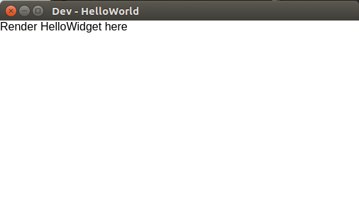

# Reactopya hello world project

This is an example of a bare bones reactopya project. The following steps were taken to produce this example

## Step: Install reactopya

See the reactopya project page for instructions

## Step: create a new project and a first widget

Initialize a new project:

```
> mkdir hello_world
> cd hello_world
> reactopya init-project
Name of project (no spaces): HelloWorld
Version (e.g., 0.1.0): 0.1.0
Description: A hello-world intro project for reactopya
Author: Jeremy Magland
License (e.g., Apache-2.0): Apache-2.0 
```

This will create the following files (which you may edit further):

```
reactopya.config.json
dev_widget.json
package.json
widgets/
    index.js
    __init__.py
```

Now create a first widget:

```
> reactopya new-widget
Name of new widget component (e.g., SomeView): HelloWidget
Brief description of the new widget: An example reactopya widget  
Writing: widgets/HelloWidget/HelloWidget.json
Writing: widgets/HelloWidget/__init__.py
Writing: widgets/HelloWidget/HelloWidget.py
Writing: widgets/HelloWidget/HelloWidget.js
4 files processed, 4 changed
Writing: widgets/__init__.py
Writing: widgets/index.js
```

As indicated in the console output, some source files are automatically generated in the widgets/ directory.

## Step: Start developing

Edit the `dev_widget.json` file to have the following content:

```
{
    "widget": { 
        "type": "HelloWidget",
        "props": {}
    }
}
```

This tells reactopya that we are focusing on developing the HelloWidget widget that we just created.

Now install and run the development application:

```
# You only need to run this once (or any time the js dependencies change)
reactopya install-dev
```

```
reactopya start-dev
```

If everything was installed properly you should see an electron browser window showing the new widget displaying "Render HelloWidget here".



This window is open in hot-module-reload mode, so you can simply edit the source code inside widgets/HelloWidget/. If you edit the .js code, the window will automatically update. If you edit the .py code, you will need to manually trigger an update via Ctrl+R on the electron window.

Note: as you edit the code in the widgets/ folder, reactopya will automatically copy it to the appropriate place in the generated/ directory. Everything inside the generated/ directory is automatically generated and should not be edited manually.

## Step: install the project

To install the project for use outside of development mode, run the following in the root directory of the project:

```
reactopya install
```

Now you should be able to use the widgets you developed in any of the following contexts:

* Jupyter notebook
* Colab notebook
* Desktop application (electron)
* Hosted server (reactopya-server)

